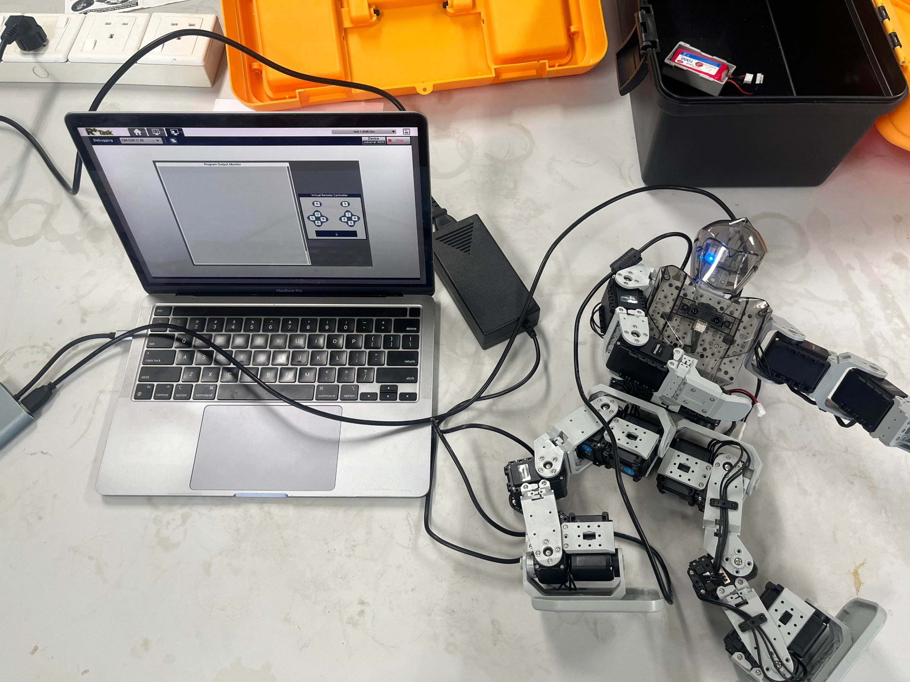
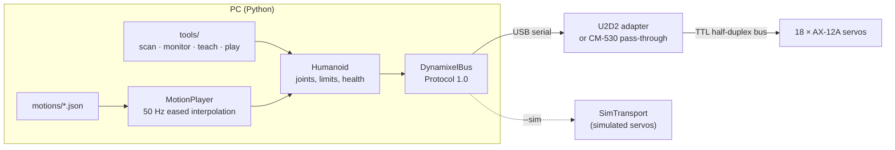

# Bioloid Humanoid Robot: CM-530 + Dynamixel AX-12A

[](https://github.com/ibrahimelsayed804/bioloid-humanoid-cm530/actions/workflows/tests.yml)


An 18-servo humanoid robot built from the ROBOTIS Bioloid platform: assembled, wired and
programmed by hand, then extended with an open-source **Python control layer** that talks to
the servos directly over Dynamixel Protocol 1.0.


<sub>The robot connected over USB to ROBOTIS R+ Task in debugging mode, with the Program Output Monitor and Virtual Remote Controller open.</sub>

---

## The project in two parts

**1. Build and original programming (University of Wollongong, Malaysia campus)**
- Assembled the full humanoid: legs, torso, arms and head, with 18 Dynamixel AX-series servos on a daisy-chained TTL bus.
- Checked servo IDs and joint ranges, routed the cabling and powered the robot from an 11.1 V LiPo.
- Programmed behaviours in **ROBOTIS R+ Task** on the CM-530 controller: remote-controller inputs mapped to motion sequences.
- Debugged live over USB serial with R+ Task's Program Output Monitor and Virtual Remote Controller.

See [docs/original-rplus-task.md](docs/original-rplus-task.md).

**2. Python control layer (this repository's code)**

R+ Task is a closed, graphical environment. To make the robot scriptable, testable and
version-controlled, I wrote a small Python package that replaces it on the PC side:

| Module | What it does |
|---|---|
| [`bioloid/protocol.py`](bioloid/protocol.py) | Dynamixel Protocol 1.0 packet encoding/decoding, checksums, sync write |
| [`bioloid/bus.py`](bioloid/bus.py) | Serial bus access with retries and timeouts, servo scan |
| [`bioloid/ax12.py`](bioloid/ax12.py) | AX-12A control table and unit conversions |
| [`bioloid/robot.py`](bioloid/robot.py) | Named joints, mirrored left/right conventions, joint limits, no-jump torque enable, health checks |
| [`bioloid/motion.py`](bioloid/motion.py) | JSON keyframe motions, cosine-eased interpolation, 50 Hz playback, left/right mirroring |
| [`bioloid/sim.py`](bioloid/sim.py) | Software model of the servo bus, so every tool runs without hardware |

## Architecture



Whole-body poses go out as a single **sync-write** packet, so all 18 joints update in one bus
transaction instead of 18 separate writes.

## Quick start (no robot needed)

```bash
git clone https://github.com/ibrahimelsayed804/bioloid-humanoid-cm530.git
cd bioloid-humanoid-cm530

python tools/scan.py --sim                          # find all 18 servos
python tools/monitor.py --sim --once                # joint angles, voltage, temperature, load
python tools/play.py motions/wave_right.json --sim  # play a motion in the simulator
python tools/play.py motions/wave_right.json --sim --mirror   # same wave, left arm

python -m unittest discover -s tests -t . -v        # 26 tests, standard library only
```

## Running on the real robot

```bash
pip install pyserial
python tools/scan.py    --port /dev/ttyUSB0                 # all 18 IDs should answer
python tools/monitor.py --port /dev/ttyUSB0                 # check joint directions by hand
python tools/play.py motions/ready.json --port /dev/ttyUSB0 --slow 2
```

The serial port is `/dev/tty.usbserial-*` on macOS and `COMx` on Windows. Use `--baud 1000000`
with a U2D2 or USB2Dynamixel adapter (the default), or the controller's PC-side rate when going
through the CM-530. [docs/hardware.md](docs/hardware.md) explains both options.

**First-run checklist**
1. Run `scan.py` and make sure every ID in the joint map answers.
2. With torque off, move each limb by hand in `monitor.py`. If a joint's angle changes the opposite way to its mirror partner, flip its `direction` in [`config/humanoid_type_a.json`](config/humanoid_type_a.json).
3. Record the robot's real standing pose with `teach.py` and compare it with `motions/ready.json`.
4. Play motions at `--slow 2` first, on a flat surface, with a hand near the robot.

Torque is limited to 80% by default, and `monitor.py` flags hot servos (≥ 65 °C), low battery
(< 10 V) and overload.

## Motions

Motions are plain JSON keyframes. Joints that a keyframe leaves out keep their previous target.

```json
{
  "name": "wave_right",
  "keyframes": [
    {"pose": {"r_shoulder_pitch": -140, "r_shoulder_roll": -30, "r_elbow": 50}, "duration": 0.8, "hold": 0.1},
    {"pose": {"r_elbow": 15}, "duration": 0.3},
    {"pose": {"r_elbow": 60}, "duration": 0.3}
  ]
}
```

Included: `ready`, `wave_right`, `bow`, `squat` and `arms_up`. The angles are starting values
verified in simulation against the joint limits. Tune them on your own robot, or record new
motions by posing the robot by hand:

```bash
python tools/teach.py --port /dev/ttyUSB0 --out motions/my_motion.json
```

## Repository layout

```
bioloid-humanoid-cm530/
├── bioloid/            Python package (protocol, bus, robot, motion, simulator)
├── config/             joint map: IDs, names, directions, trims and limits
├── motions/            keyframe motion files (JSON)
├── tools/              scan, monitor, teach and play command-line tools
├── tests/              unit and simulation tests (run in GitHub Actions)
└── docs/               hardware, servo map, original R+ Task programming, photos
```

## Roadmap

- [ ] Gyro feedback for balance correction while standing and squatting
- [ ] Walking gait generated from a simple inverted-pendulum model
- [ ] Forward and inverse kinematics for the legs
- [ ] ROS 2 bridge publishing `/joint_states` for visualisation in RViz

## What I learned

- Building mechanically: joint alignment and cable routing decide whether the software can work at all.
- Debugging on embedded targets: tracing control flow live over serial, not just reading code.
- Communication protocols at the byte level: framing, checksums, half-duplex timing and broadcast writes.
- Testing hardware code without hardware: a simulator turns a fragile robot into something you can test in CI.

## Author

**Ibrahim Said Hussein Elsayed**, Mechatronics & Robotics Engineer
[LinkedIn](https://www.linkedin.com/in/ibrahim-said-hussein-elsayed) · [GitHub](https://github.com/ibrahimelsayed804)

Released under the [MIT License](LICENSE).
