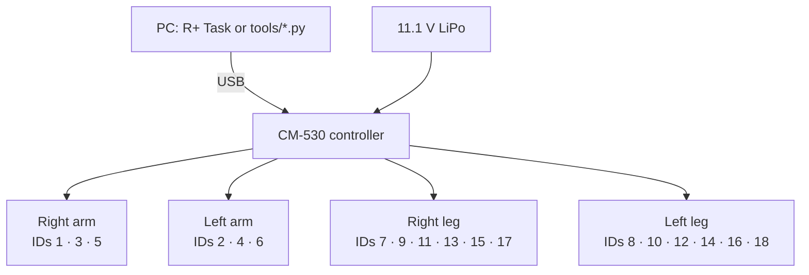

# Hardware

## Components

| Part | Role |
|---|---|
| ROBOTIS **CM-530** controller | ARM Cortex-M3 main controller; runs R+ Task programs and drives the servo bus |
| 18 × Dynamixel **AX-12A** smart servos | Joints. Each has its own ID, position sensing, temperature/voltage/load feedback |
| 11.1 V 3-cell LiPo, 1000 mAh | Main power for the controller and servos |
| Bioloid frames and brackets | Mechanical structure (legs, torso, arms, head) |
| USB cable | Programming and live debugging from the PC |

## How the servos are connected

AX-12A servos share a **half-duplex TTL serial bus**: one data line carries traffic in both
directions, plus power and ground (3-pin cables). Each servo has two connectors, so the
servos are daisy-chained limb by limb back to the controller's bus ports. Each servo
answers only to its own ID, which is why every ID on the bus must be unique.

The exact chaining (which limb plugs into which port) depends on the build. Any order
works electrically as long as IDs are unique.

## Connecting the Python tools

**Option A: U2D2 or USB2Dynamixel adapter (recommended)**
Plug the adapter into the servo bus in place of, or alongside, the controller. Power the
servos from the battery or a 12 V supply. Use `--baud 1000000`, the AX-12A factory default.

**Option B: through the CM-530's USB port**
The PC talks to the controller, which forwards packets to the servo bus. ROBOTIS CM-series
controllers provide a pass-through ("toss") mode for this from their management mode. The
PC-side baud rate and the exact steps depend on the controller firmware, so check the
ROBOTIS e-Manual for the CM-530 before using this option. If `scan.py` finds nothing at
`--baud 57600`, use Option A.

Adapters that echo transmitted bytes on the half-duplex line need `--echo`.

## Power and safety notes

- Never fully discharge the LiPo. `monitor.py` warns below 10 V.
- AX-12A servos shut down when they overheat. `monitor.py` warns from 65 °C; let them cool before continuing.
- Turning torque off makes a standing robot collapse, so support it first.
